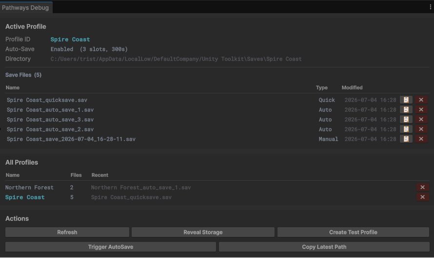

# Pathways

Pathways tells your game _where_ to write and read save files. You still serialize your own data (JSON, binary, whatever you like) and call `File.WriteAllText`, `JsonUtility`, `MemoryPack`, etc. Pathways handles the rest: folder layout, naming, quick-save vs manual-save vs auto-save slots, and switching between separate playthroughs.

**[Installation](#installation)** · **[Quick start](#quick-start)** · **[Concepts](#concepts)** · **[Save types](#save-types)** · **[Auto-save](#auto-save)** · **[Profiles](#profiles)**



_The Pathways Debug Window (**Tools → Pathways → Debug Window**). Inspect profiles, browse saves on disk, copy paths, and delete files while iterating in the Editor._

---

## Installation

**Requirements:** Unity 2021.3 or newer.

1. Open **Window → Package Manager**.
2. Click **+** → **Add package from git URL…**
3. Paste:

```text
https://github.com/Tirtstan/Pathways.git
```

---

## Quick start

### 1. Point at a save folder and pick a profile

A **profile** could be a playthrough, level, world, campaign, lobby session, etc. Each profile gets its own subfolder within your storage root. `LoadProfile` only selects the active profile in memory; the folder is created on disk the first time you call `GetPath` and write a save.

```csharp
using Tirt.Pathways;
using System.IO;
using UnityEngine;

public class GameBootstrap : MonoBehaviour
{
    private void Awake()
    {
        Pathways.StorageLocation = Path.Combine(Application.persistentDataPath, "Saves");
        Pathways.LoadProfile("Northern_Forest");
    }
}
```

### 2. Ask for a path, then save or load yourself

```csharp
using Tirt.Pathways;
using System.IO;

// Save: get a path, write your data
string path = Pathways.GetPath(SaveType.Manual);
File.WriteAllText(path, myJson);

// Load: find the newest file, read your data
string latest = Pathways.GetLatest();
if (latest != null)
    myJson = File.ReadAllText(latest);

// List saves for a load-game menu (newest first)
FileInfo[] saves = Pathways.GetSaves(SaveType.Manual);
```

See the sample scene (`Samples/Examples`) and `SaveManager.cs` for a full working example with JSON serialization.

---

## Concepts

### Storage layout

Everything lives under `Pathways.StorageLocation`. Each profile is a subfolder; each save is a file inside that folder. Profile folders only appear after the first save to that profile.

```text
Saves/                              ← Pathways.StorageLocation
├── Crater_Lakes/             ← one profile (one playthrough)
│   ├── Crater_Lakes_quicksave.sav
│   ├── Crater_Lakes_before_boss.sav
│   ├── Crater_Lakes_save_2026-07-04_15-30-00.sav
│   └── Crater_Lakes_auto_save_1.sav
└── Grasslands/             ← a different playthrough
    └── Grasslands_quicksave.sav
```

Files are prefixed with the profile name so a single `.sav` (configurable) file is self-contained, you can move or share it without breaking anything.

### The three API calls you'll use

| Method                      | When to use it                                            |
| --------------------------- | --------------------------------------------------------- |
| `GetPath(SaveType type)`    | Saving: returns the path to write to                      |
| `GetLatest(SaveType? type)` | Loading: returns the most recent existing file, or `null` |
| `GetSaves(SaveType? type)`  | UI: returns all matching files, newest first              |

All three operate on the **active profile** (set by `LoadProfile` or `SetActiveProfile`).

---

## Save types

```csharp
// Manual: creates a new file (timestamp if no name given)
Pathways.GetPath(SaveType.Manual);              // …_save_2026-07-04_15-30-00.sav
Pathways.GetPath(SaveType.Manual, "phase_4"); // …_phase_4.sav

// Quick save: always the same file, overwritten each time
Pathways.GetPath(SaveType.QuickSave);           // …_quicksave.sav

// Auto save: cycles through numbered slots (see below)
Pathways.GetPath(SaveType.AutoSave);            // …_auto_save_1.sav
```

Pass a `SaveType` to `GetLatest` or `GetSaves` to filter by type, or omit it to include all types.

---

## Auto-save

Pathways can fire a timer that asks you to save on a schedule. Subscribe to the event, write your data when it fires, and enable the timer:

```csharp
private void Start()
{
    Pathways.OnAutoSavePathRequested += OnAutoSaveRequested;
    Pathways.EnableAutoSave(interval: 300f, slots: 3); // every 5 min, 3 rotating slots
}

private void OnAutoSaveRequested(string path)
{
    File.WriteAllText(path, myJsonData);
}

private void OnDestroy()
{
    Pathways.OnAutoSavePathRequested -= OnAutoSaveRequested;
}
```

Auto-save slots rotate: once all slots are used, the oldest file gets overwritten next. You control the interval and slot count; Pathways only picks the path.

---

## Profiles

Use profiles when your game has multiple independent playthroughs: separate worlds, campaigns, or player sessions.

```csharp
Pathways.LoadProfile("Northern_Forest");       // load and activate
Pathways.SetActiveProfile("Grasslands");  // switch to another
Pathways.SelectRecentProfile();                     // switch to whichever was saved last

string[] ids = Pathways.GetAllProfileIds();       // list all profiles on disk
Pathways.DeleteProfile("Crater_Lakes");              // delete a profile and all its saves
```
